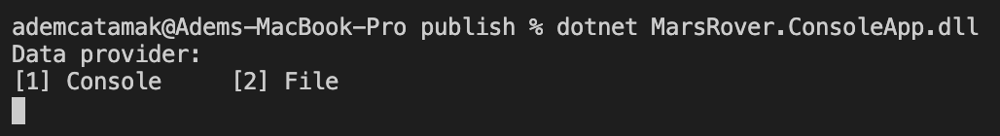
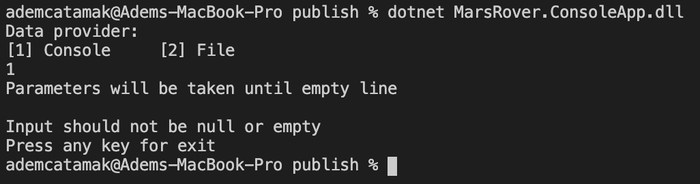
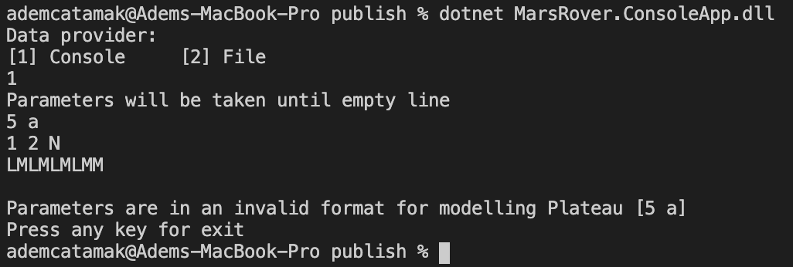
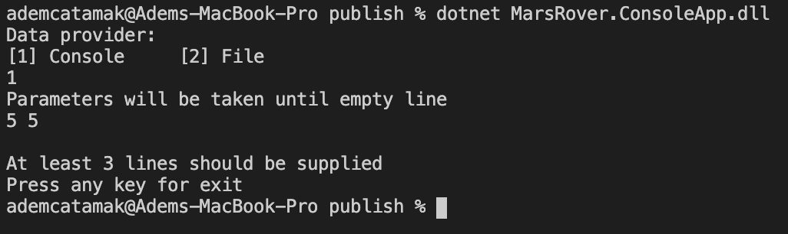
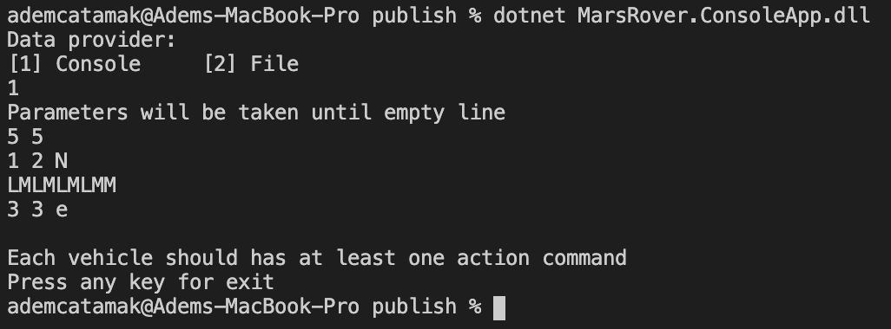
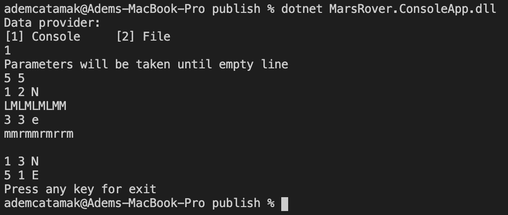
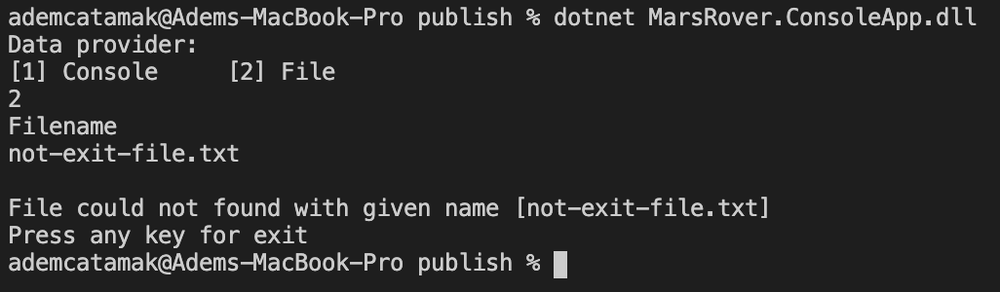
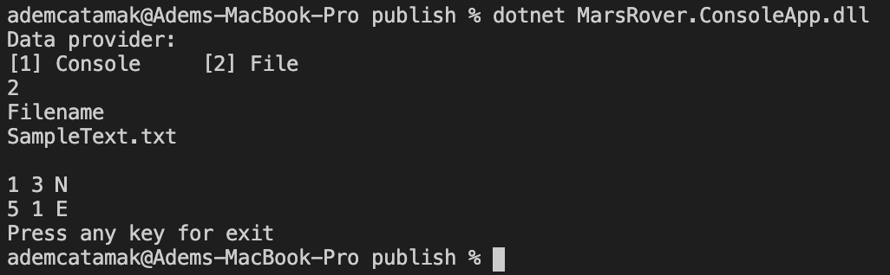

**GitHub**


# Mars Rover Problem

A squad of robotic rovers are to be landed by NASA on a plateau on Mars.

This plateau, which is curiously rectangular, must be navigated by the rovers so that their on board cameras can get a complete view of the surrounding terrain to send back to Earth.

A rover's position is represented by a combination of an x and y co-ordinates and a letter representing one of the four cardinal compass points. The plateau is divided up into a grid to simplify navigation. An example position might be 0, 0, N, which means the rover is in the bottom left corner and facing North.

In order to control a rover, NASA sends a simple string of letters. The possible letters are 'L', 'R' and 'M'. 'L' and 'R' makes the rover spin 90 degrees left or right respectively, without moving from its current spot.

'M' means move forward one grid point, and maintain the same heading.

Assume that the square directly North from (x, y) is (x, y+1).

## Input:

The first line of input is the upper-right coordinates of the plateau, the lower-left coordinates are assumed to be 0,0.

The rest of the input is information pertaining to the rovers that have been deployed. Each rover has two lines of input. The first line gives the rover's position, and the second line is a series of instructions telling the rover how to explore the plateau.

The position is made up of two integers and a letter separated by spaces, corresponding to the x and y co-ordinates and the rover's orientation.

Each rover will be finished sequentially, which means that the second rover won't start to move until the first one has finished moving.

## Output:

The output for each rover should be its final co-ordinates and heading.

Test Input:

```
5 5
1 2 N
LMLMLMLMM
3 3 E
MMRMMRMRRM
````

Expected Output:

```
1 3 N
5 1 E
```

# Usage

Application has multiple input providers. This means users can provide input from different channels such as via `Console` or `File`. The first requirement for application is the information of how the input is provided.



## Input from Console

When the application starts, if user enter `1` as an input, application begins to wait for a parameter on console. As it can be seen from the sample input above, the first given line is used to build `Surface` object. Every two lines after the first line is used to generate relationship between vehicle and the commands that will be given to that vehicle.

Regarding the input provided:

- If the input is empty,
- If the surface parameters are empty or in an invalid format,
- If vehicle parameters are empty or in an invalid format,
- If vehicle command parameters are empty or in an invalid format,

a message that explains the situation is shown on the console.

SAMPLE CASES

Case 1 : Input is empty



Case 2 : Surface size parameters are not valid



Case 3 : Number of line is insufficent



Case 4 : Vehicle action commands are missing



If the provided input is well-formed, results for each vehicle are shown on console respectively.




## Input from File

When the application starts, if user enter `2` as an input, application begins to wait for a file name input on console.


In the following cases:

- If file does not exist,
- If file content is in an invalid format,

a message that explains the situation is shown on the console.

SAMPLE CASES

Case 1: File does not exist



If file can be found with the provided file name and file content is in an valid format, results for each vehicle are shown on console respectively.

